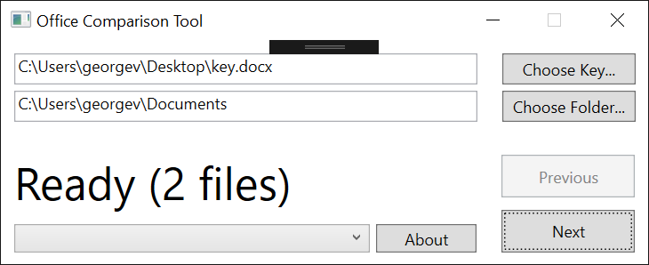

This is a small tool to partially automate comparing a set of Office documents against a single key.

To use it, click "Choose Key" and find your "key document" in the dialog.
This is the file against which all the other files will be compared.

Next, click "Choose Folder" and find the folder containing all the documents to be compared against the key document.

Now the status should say "Ready."
You can click the drop-down menu to choose a particular file to start comparing, or just click "Next" to launch the Office comparison against the first file.
